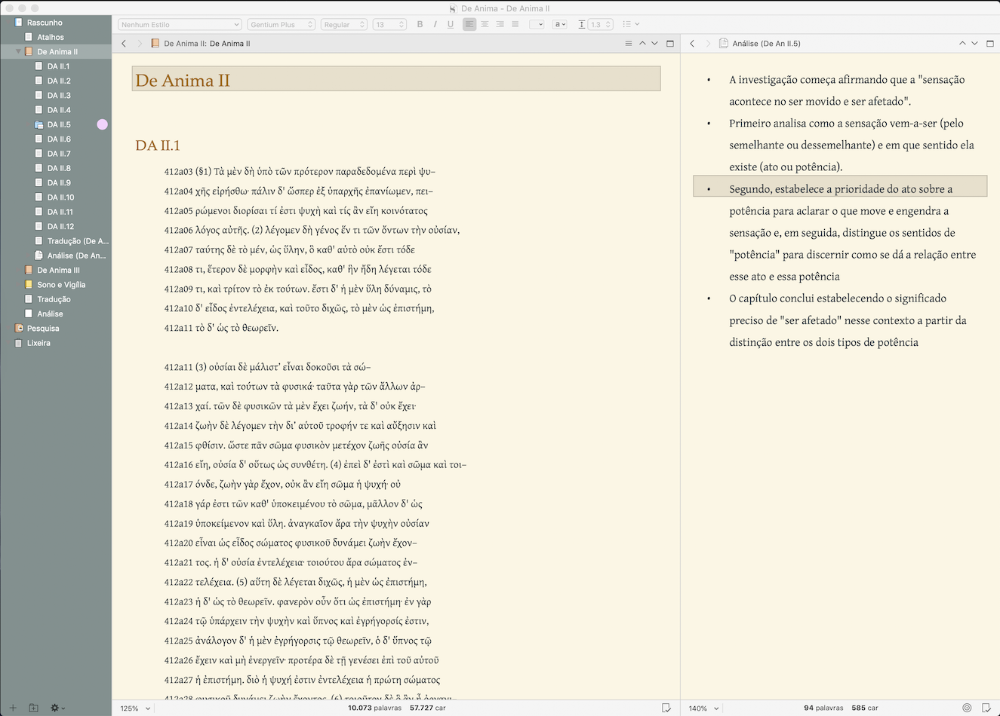
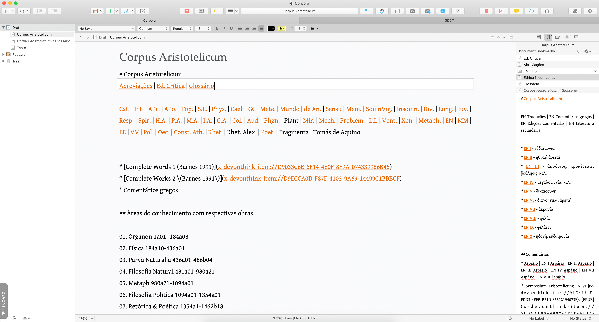
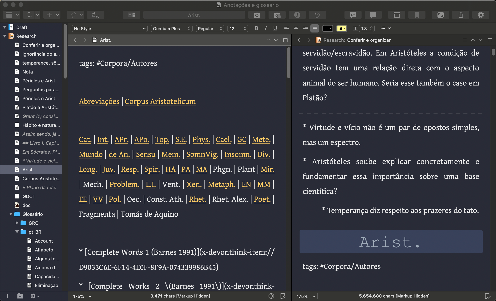
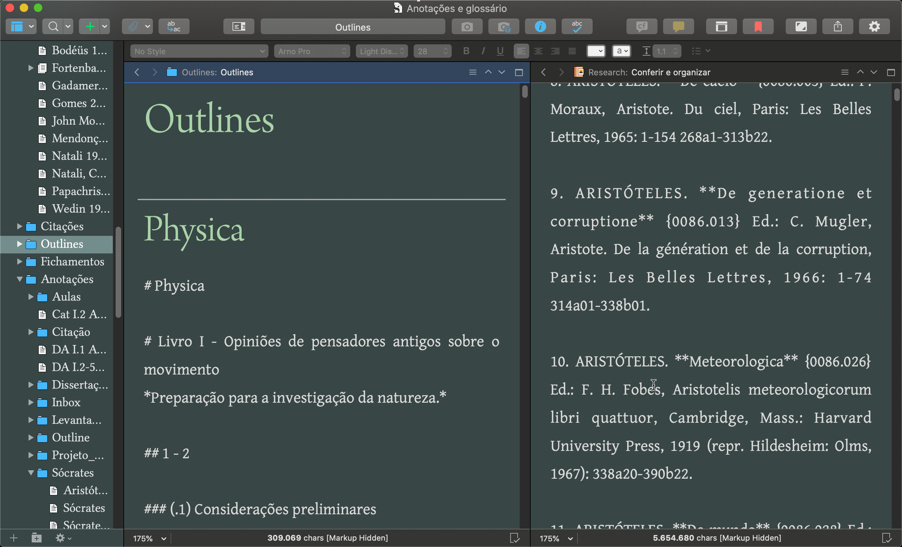

# Scrivener

## Solarized




## Ayu



```
selection: #ecf1f5;
fonte: #6b6881;
ui: #e2e3e7;
code-background: #ffffff;
header: #4f5254;
tag-#: #73787e;
ayu: #bfc0c4;
tag-background: #bfc1c4;
fundo: #fafafb;
ayu-2: #fda754;
link: #d76f2b;


```


## Ayu Mirage



```
ayu-mirage-2: #292d3b;
ayu-mirage: #f6f6ee;
link: #f6ce75;
tag-background: #3a4158;
header: #a1aab7;
fonte: #d9d8d2;
fundo-bbedit: #292b36;
fundo: #1f232e;
```


## Tomorrow Night 



`````
header: #b2d2ac;
links: #6f7a92;
line-highlight: #5a5b5b;
text: #d6d5d5;
background: #384646;
background: #3b3b3c;
selection: #646364;
`````